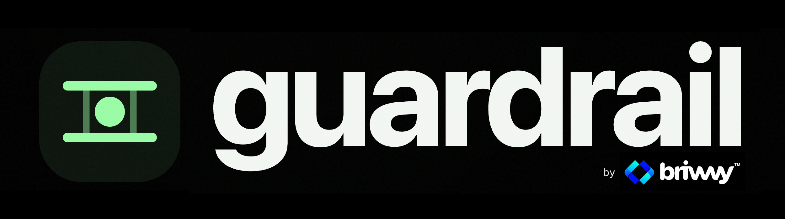

[](https://github.com/brivvvy-ai/guardrail/actions/workflows/ci.yml)
[](https://www.npmjs.com/package/PACKAGE-NAME)
[](LICENSE)
[](package.json)
[](https://www.typescriptlang.org/)


# Brivvvy Guardrail

**A deterministic policy engine for guarded agent autonomy.**

Brivvvy Guardrail answers a deliberately narrow question:

> Given an intended action and observable context, what is the system permitted
> to do next?

It does not call an LLM. It does not execute tools. It does not infer permissions.
It does not hide policy inside prompts. It evaluates explicit policy and returns
a structured decision.

```text
Action Context
     │
     ▼
Runtime Validation
     │
     ▼
Exact Policy Match
     │
     ├── Permissions
     ├── Confidence
     ├── Risk
     ├── Reversibility
     ├── Provider Constraints
     └── Settings
     │
     ▼
Guardrail Decision
     │
     ├── Observe
     ├── Recommend
     ├── Draft
     ├── Request Approval
     ├── Execute
     └── Escalate
```

Version `0.1.0` is intentionally small, deterministic, strongly typed, and
framework-independent.

## Why this exists

AI systems increasingly move from producing text to performing work. Once an
agent can change external state, a model response is not enough of a control
boundary.

An application needs an explicit answer to questions such as:

- Does this actor have permission to perform the action?
- Is confidence high enough for autonomous execution?
- Is the action's risk within the policy threshold?
- Is the action reversible when policy requires reversibility?
- Does a provider limitation block execution?
- Has the application explicitly enabled this class of action?
- Should a human approve the action instead?
- Should the action be escalated rather than attempted?

Guardrail makes those decisions policy-as-code.

## Properties

- **Deterministic** — same validated policy + same context = same decision.
- **Fail closed** — missing policy never authorizes execution.
- **Explicit** — no hidden thresholds and no model-generated policy.
- **Explainable** — every denied/guarded decision contains structured reasons.
- **Bounded** — failed controls can request approval or escalate; they cannot
  increase autonomy.
- **Runtime validated** — TypeScript is not treated as runtime validation.
- **Side-effect free** — the engine does not network, persist, log, or act.
- **Zero runtime dependencies** — the published engine requires only JavaScript.
- **Framework independent** — use it with any agent framework or no framework.
- **MIT licensed** — use, modify, and redistribute it under the MIT License.

## Requirements

- Node.js 20 or newer for this repository's development/test workflow.
- TypeScript 5.x for source builds.

The generated package itself has no runtime dependency.

## Installation

Once published:

```bash
npm install @brivvvy/guardrail
```

For this source package:

```bash
npm install
npm run check
```

## Five-minute example

Define a policy:

```ts
import { createGuardrail, definePolicy } from "@brivvvy/guardrail";

const sendExternalMessage = definePolicy({
  id: "send-external-message",
  action: "send_external_message",
  description: "Gate execution of an external message.",
  onPass: "execute",
  controls: [
    {
      kind: "permissions",
      allOf: ["message:send"],
      onFailure: "escalate",
    },
    {
      kind: "confidence",
      atLeast: 0.95,
      onFailure: "request_approval",
    },
    {
      kind: "risk",
      atMost: "low",
      onFailure: "request_approval",
    },
    {
      kind: "reversibility",
      mustBe: true,
      onFailure: "request_approval",
    },
  ],
});

const guardrail = createGuardrail({
  policies: [sendExternalMessage],
});
```

Evaluate an intended action:

```ts
const decision = guardrail.evaluate({
  action: "send_external_message",
  permissions: ["message:send"],
  confidence: 0.91,
  risk: "low",
  reversible: true,
});
```

Result:

```ts
{
  action: "send_external_message",
  matchedPolicy: true,
  policyId: "send-external-message",
  disposition: "request_approval",
  canExecute: false,
  requiresHuman: true,
  controlsEvaluated: 4,
  controlsFailed: 1,
  reasons: [
    {
      code: "CONFIDENCE_BELOW_THRESHOLD",
      control: "confidence",
      message: "Confidence is below the minimum required by policy.",
      details: {
        actual: 0.91,
        minimum: 0.95
      }
    }
  ]
}
```

The engine has not sent anything. Your application decides how to implement the
approval workflow.

## Enforce the decision

Guardrail is useful only when its decision is enforced at the action boundary.

```ts
const decision = guardrail.evaluate(context);

if (!decision.canExecute) {
  return {
    performed: false,
    decision,
  };
}

await externalProvider.performAction();
```

For sensitive systems, enforce this server-side alongside the application's own
authentication and authorization.

## Guarded-autonomy dispositions

Guardrail uses six autonomy states:

| Disposition | Meaning |
| --- | --- |
| `observe` | Observe state; do not prepare or execute a change. |
| `recommend` | Produce a recommendation without preparing an external action. |
| `draft` | Prepare work, but do not execute it. |
| `request_approval` | Human approval is required before execution. |
| `execute` | Policy permits the application to proceed with execution. |
| `escalate` | Human judgment is required before proceeding. |

`canExecute` is true **only** when the final disposition is `execute`.

`requiresHuman` is true for `request_approval` and `escalate`.

## Policy anatomy

```ts
const policy = definePolicy({
  id: "unique-policy-id",
  action: "exact_action_identifier",
  description: "Why this policy exists.",
  onPass: "execute",
  controls: [
    // deterministic controls
  ],
});
```

### `id`

A unique policy identifier. Duplicate IDs are rejected when a registry is
created.

### `action`

An exact action identifier. v0.1 permits exactly one policy per action.

No wildcards. No regex. No implicit priority.

This avoids policy-selection ambiguity.

### `description`

Required human-readable purpose. Guardrail does not use it to make decisions.

### `onPass`

The disposition returned when every control passes. It may be any of the six
guarded-autonomy states.

This supports policies whose successful state is intentionally `draft`,
`recommend`, or another bounded state rather than execution.

### `controls`

All configured controls are evaluated. Guardrail collects all failures rather
than returning only the first one.

## Permission controls

Require all permissions:

```ts
{
  kind: "permissions",
  allOf: ["record:read", "record:write"],
  onFailure: "escalate",
}
```

Require at least one:

```ts
{
  kind: "permissions",
  anyOf: ["role:owner", "role:operator"],
  onFailure: "escalate",
}
```

Forbid a permission/capability state:

```ts
{
  kind: "permissions",
  noneOf: ["account:suspended"],
  onFailure: "escalate",
}
```

Clauses can be combined in one control.

## Confidence controls

```ts
{
  kind: "confidence",
  atLeast: 0.92,
  onFailure: "request_approval",
}
```

Confidence values are normalized to `0..1`, inclusive.

Guardrail does **not** calculate confidence. Your system remains responsible for
ensuring a confidence value is evidence-based and appropriately calibrated.

If the policy requires confidence and the context omits it, the control fails.

## Risk controls

```ts
{
  kind: "risk",
  atMost: "medium",
  onFailure: "request_approval",
}
```

Risk ordering is deterministic:

```text
low < medium < high < critical
```

A `medium` maximum therefore accepts `low` and `medium`, but guards `high` and
`critical`.

Guardrail does not calculate risk. Risk classification belongs to the caller's
application domain.

## Reversibility controls

```ts
{
  kind: "reversibility",
  mustBe: true,
  onFailure: "request_approval",
}
```

Unknown reversibility is not assumed. If the policy requires it, omission fails
the control.

## Provider-constraint controls

```ts
{
  kind: "provider_constraints",
  noneOf: ["read_only", "writes_disabled"],
  onFailure: "escalate",
}
```

The application supplies the currently active provider constraints:

```ts
const decision = guardrail.evaluate({
  action: "update_external_record",
  providerConstraints: ["writes_disabled"],
});
```

Guardrail itself performs no provider calls.

## Setting controls

Applications can supply generic primitive settings:

```ts
{
  kind: "setting",
  key: "external_actions_enabled",
  equals: true,
  onFailure: "request_approval",
}
```

Context:

```ts
{
  action: "send_external_message",
  settings: {
    external_actions_enabled: true,
  },
}
```

Supported setting values are:

```ts
type GuardrailPrimitive = string | number | boolean | null;
```

Setting mismatch decisions intentionally identify the setting key without
returning the actual or required value. This reduces accidental disclosure in
decision records.

Do not store secrets in Guardrail settings.

## Failure resolution

Every failed control declares one of two safe outcomes:

```ts
onFailure: "request_approval"
```

or:

```ts
onFailure: "escalate"
```

When multiple controls fail:

1. Guardrail returns every structured failure reason.
2. If **any** failed control requires escalation, final disposition is
   `escalate`.
3. Otherwise final disposition is `request_approval`.

A failed control can never cause `execute`.

## Missing policy behavior

Missing actions fail closed:

```ts
const guardrail = createGuardrail({
  policies: [],
});

const decision = guardrail.evaluate({
  action: "unknown_action",
});

console.log(decision.disposition); // "escalate"
```

You may explicitly configure approval instead:

```ts
createGuardrail({
  policies,
  missingPolicyDisposition: "request_approval",
});
```

Those are the only supported missing-policy outcomes.

## Runtime validation

Public runtime inputs are validated before policy evaluation.

Examples of rejected values include:

- empty action identifiers;
- duplicate policy IDs;
- multiple policies for the same action;
- confidence below `0` or above `1`;
- `NaN` and infinite numeric values;
- unknown risk levels;
- empty permission clauses in policy;
- duplicate identifiers in permission/constraint lists;
- unsupported failure dispositions;
- unsupported setting values.

Configuration/input errors throw:

```ts
GuardrailValidationError
GuardrailConfigurationError
```

A valid policy denial/guarded result is **not** an error. It returns a normal
`GuardrailDecision`.

## Structured reasons

Reason codes are stable public vocabulary for programmatic handling.

Current codes:

```text
POLICY_PASSED
POLICY_NOT_FOUND
PERMISSION_ALL_OF_MISSING
PERMISSION_ANY_OF_MISSING
PERMISSION_FORBIDDEN_PRESENT
CONFIDENCE_REQUIRED
CONFIDENCE_BELOW_THRESHOLD
RISK_REQUIRED
RISK_EXCEEDS_MAXIMUM
REVERSIBILITY_REQUIRED
REVERSIBILITY_MISMATCH
PROVIDER_CONSTRAINT_FORBIDDEN
SETTING_REQUIRED
SETTING_MISMATCH
```

Reasons contain concise observable rationale. Guardrail never exposes or
requires hidden model chain-of-thought.

## Direct policy evaluation

If you do not need a registry:

```ts
import { evaluatePolicy } from "@brivvvy/guardrail";

const decision = evaluatePolicy(policy, context);
```

The policy and context action must match exactly.

For most applications, `createGuardrail()` is preferable because it centralizes
policy registration and fail-closed missing-policy behavior.

## Inspecting registered policies

```ts
const policy = guardrail.getPolicy("send_external_message");
const policies = guardrail.listPolicies();
```

`listPolicies()` returns a frozen registry snapshot array. Guardrail does not
serialize or persist policies for you.

## Determinism

Evaluation uses no:

- network requests;
- model calls;
- wall clock;
- randomness;
- database access;
- environment lookup;
- hidden global configuration.

This means policy decisions can be unit tested and reproduced from the policy
and context used to create them.

## Security model

Guardrail is **not** a replacement for application security.

It does not authenticate users or enforce server permissions. Treat it as one
explicit policy layer inside a larger trusted action boundary.

Recommended sequence:

```text
Authenticate
    ↓
Authorize
    ↓
Build trusted action context
    ↓
Guardrail evaluate
    ↓
Require approval / escalate / continue
    ↓
Provider-specific validation
    ↓
Execute
    ↓
Audit outcome
```

See [`docs/SECURITY_MODEL.md`](docs/SECURITY_MODEL.md).

## What belongs in context?

Only include facts needed by policy.

Good:

```ts
{
  action: "send_external_message",
  confidence: 0.97,
  risk: "low",
  reversible: true,
  permissions: ["message:send"],
  providerConstraints: [],
  settings: {
    external_actions_enabled: true,
  },
}
```

Avoid dumping arbitrary user records, prompts, model transcripts, credentials,
or private application state into the context. Guardrail has no need for them.

## What Guardrail deliberately does not do

v0.1 does not include:

- model inference;
- prompt-based policy;
- tool execution;
- approval UI;
- audit persistence;
- confidence calculation;
- risk calculation;
- identity/authentication;
- tenant isolation;
- provider adapters;
- wildcard policy matching;
- policy priorities;
- arbitrary user-defined JavaScript predicates;
- policy inheritance;
- remote policy loading.

Several omissions are deliberate safety properties, not missing features.

For example, arbitrary predicate functions would make policies more expressive,
but also less portable, less inspectable, and harder to validate. v0.1 favors a
small declarative surface.

## Testing

Run the complete local gate:

```bash
npm run check
```

It performs:

```text
Type check
    ↓
106+ behavioral and invariant tests
    ↓
Production build
    ↓
Repository secret-hygiene check
```

Run tests only:

```bash
npm test
```

Run built-in Node coverage:

```bash
npm run test:coverage
```

The test suite covers, among other cases:

- exact confidence boundaries;
- every risk ordering combination;
- missing confidence/risk/reversibility;
- permission `allOf`, `anyOf`, and `noneOf`;
- multiple simultaneous permission failures;
- provider constraints;
- setting equality across primitive types;
- setting-value redaction from mismatch decisions;
- escalation precedence;
- missing-policy fail-closed behavior;
- duplicate IDs/actions;
- invalid runtime input;
- deterministic repeated evaluation;
- caller-object mutation invariants;
- decision convenience flags for every disposition.

Tests use Node's built-in test runner to keep development dependencies small.

## Build

```bash
npm run build
```

Output:

```text
dist/
├── errors.d.ts
├── errors.js
├── evaluate.d.ts
├── evaluate.js
├── guardrail.d.ts
├── guardrail.js
├── index.d.ts
├── index.js
├── policy.d.ts
├── policy.js
├── types.d.ts
├── types.js
├── validation.d.ts
└── validation.js
```

Declaration maps and source maps are also generated.

## Repository structure

```text
brivvvy-guardrail/
├── src/
│   ├── errors.ts
│   ├── evaluate.ts
│   ├── guardrail.ts
│   ├── index.ts
│   ├── policy.ts
│   ├── types.ts
│   └── validation.ts
├── tests/
│   ├── evaluate-controls.test.mjs
│   ├── guardrail.test.mjs
│   ├── invariants.test.mjs
│   └── policy-validation.test.mjs
├── examples/
│   └── quick-start.ts
├── docs/
│   ├── OPEN_SOURCE_BOUNDARY.md
│   ├── POLICY_MODEL.md
│   └── SECURITY_MODEL.md
├── scripts/
│   └── check-secrets.mjs
├── CHANGELOG.md
├── CODE_OF_CONDUCT.md
├── CONTRIBUTING.md
├── LICENSE
├── SECURITY.md
├── package.json
├── tsconfig.json
└── tsconfig.build.json
```

## Public API

Runtime exports:

```ts
createGuardrail
definePolicy
evaluatePolicy
GuardrailError
GuardrailValidationError
GuardrailConfigurationError
RISK_LEVELS
GUARDRAIL_DISPOSITIONS
```

Type exports include:

```ts
Guardrail
GuardrailContext
GuardrailControl
GuardrailDecision
GuardrailDisposition
GuardrailOptions
GuardrailPolicy
GuardrailPrimitive
GuardrailReason
GuardrailReasonCode
RiskLevel
```

See generated declarations in `dist/` after `npm run build`.

## Example: always require a draft

Not every successful policy should execute.

```ts
const policy = definePolicy({
  id: "prepare-change",
  action: "prepare_change",
  description: "This action may only prepare a draft.",
  onPass: "draft",
  controls: [],
});
```

Successful result:

```ts
{
  disposition: "draft",
  canExecute: false,
  requiresHuman: false,
  // ...
}
```

## Example: escalate missing privilege

```ts
const policy = definePolicy({
  id: "change-external-state",
  action: "change_external_state",
  description: "Require explicit execution capability.",
  onPass: "execute",
  controls: [
    {
      kind: "permissions",
      allOf: ["external:write"],
      onFailure: "escalate",
    },
  ],
});
```

A missing permission produces `escalate`, not a silent denial and not execution.
The application can then route that decision to its own escalation workflow.

## Example: combine controls

```ts
const policy = definePolicy({
  id: "bounded-external-update",
  action: "update_external_record",
  description: "Gate a bounded external write.",
  onPass: "execute",
  controls: [
    {
      kind: "permissions",
      allOf: ["external:write"],
      onFailure: "escalate",
    },
    {
      kind: "confidence",
      atLeast: 0.98,
      onFailure: "request_approval",
    },
    {
      kind: "risk",
      atMost: "low",
      onFailure: "request_approval",
    },
    {
      kind: "reversibility",
      mustBe: true,
      onFailure: "request_approval",
    },
    {
      kind: "provider_constraints",
      noneOf: ["read_only"],
      onFailure: "escalate",
    },
    {
      kind: "setting",
      key: "external_updates_enabled",
      equals: true,
      onFailure: "request_approval",
    },
  ],
});
```

## Design decisions in v0.1

### One exact policy per action

This eliminates hidden policy precedence.

### All controls are evaluated

Users receive a complete observable explanation instead of fixing one condition
only to discover another guard on the next run.

### Escalation dominates approval

If one failure can be resolved by approval but another explicitly requires
escalation, Guardrail selects the more conservative `escalate` disposition.

### Unknown required values fail

Unknown confidence, risk, or reversibility is not interpreted optimistically.

### No arbitrary predicates

Policies remain data rather than executable application code.

### No model dependency

A model cannot rewrite the guardrail while being guarded by it.

## Versioning

This project follows semantic versioning.

Before `1.0.0`, minor releases may contain breaking API changes. Those changes
should still be intentional and documented in `CHANGELOG.md`.

## Contributing

See [`CONTRIBUTING.md`](CONTRIBUTING.md).

A contribution should preserve:

- deterministic evaluation;
- explicit policy;
- strong typing;
- runtime validation;
- fail-safe behavior;
- structured explainability;
- no hidden model reasoning;
- no secret-dependent behavior.

## Open-source boundary

This repository is intentionally isolated from private Brivvvy product
implementation. It contains no customer data, credentials, private prompts,
private production configuration, proprietary business-learning logic, private
memory schemas, or internal orchestration logic.

See [`docs/OPEN_SOURCE_BOUNDARY.md`](docs/OPEN_SOURCE_BOUNDARY.md).

## Security

See [`SECURITY.md`](SECURITY.md) for vulnerability reporting and
[`docs/SECURITY_MODEL.md`](docs/SECURITY_MODEL.md) for the library security
model.

## License

MIT. See [`LICENSE`](LICENSE).

Copyright © 2026 Brivvvy.
